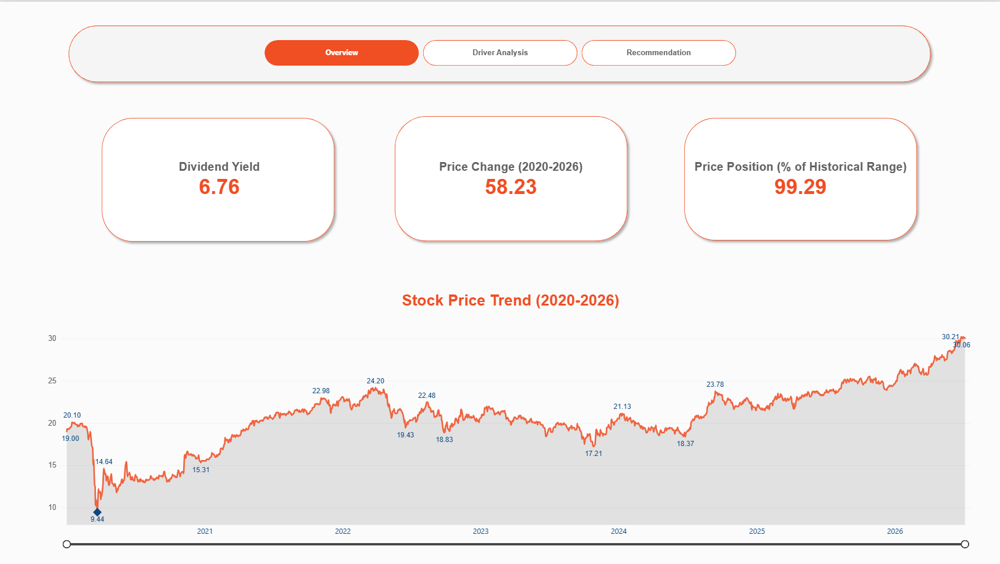
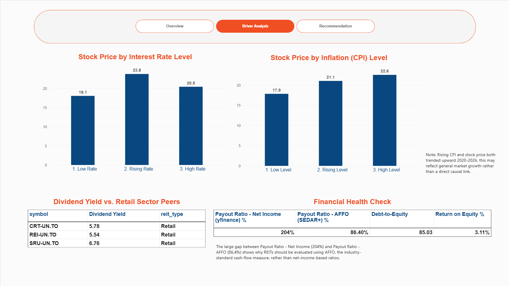
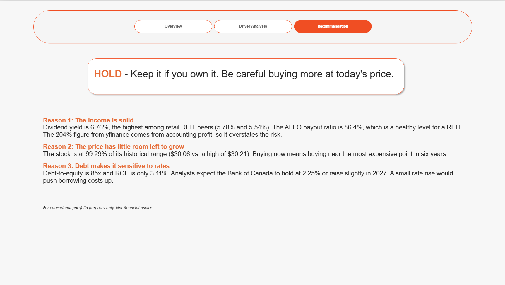

# SmartCentres REIT Investment Analysis

A solo rebuild of a group assignment (BSMM 8730, Data Acquisition & Management, University of Windsor), done to practice hand-written SQL and build a personal portfolio project.

Investment analysis (not a trading signal) of whether to buy, hold, or avoid SmartCentres REIT (SRU.UN), based on 6 years of price history (2020–2026), peer REIT comparison, macroeconomic sensitivity to interest rates and inflation, and financial health drawn from both automated data (yfinance) and manually-read regulatory filings (SEDAR+).

## Power BI Dashboard

An interactive 3-page dashboard connects directly to MySQL: overview → driver analysis → recommendation.

**Key finding:** dividend yield of 6.76% is the highest among retail REIT peers (5.78%, 5.54%), and the AFFO payout ratio is a healthy 86.4% — far from the 204% figure yfinance shows when calculated on accounting profit instead of AFFO. However, the price sits at 99.29% of its 2020–2026 range, and debt-to-equity is 85x with ROE at only 3.11%.

| Overview | Driver Analysis | Recommendation |
|---|---|---|
|  |  |  |

**Recommendation: HOLD** — keep it if you own it, be careful buying more at today's price.
1. Income is solid — yield leads the peer group, AFFO payout ratio is healthy.
2. Price has little room left to grow — near its 6-year high.
3. Debt makes it rate-sensitive — 85x debt-to-equity with modest BoC rate hikes possible in 2027.

The `.pbix` file is included in `dashboard/`. It needs a live connection to the local MySQL database to refresh, but the imported data ships with the file, so it opens and displays correctly without one.

## Repo structure
acquisition/
  yfinance_pull.py                 Price history, fundamentals, news (SmartCentres)
  wowa_scraping.py                 Peer REIT type/sector + current metrics
  interest_rate_pull.py            Bank of Canada overnight rate
  inflation_cpi_pull.py            Bank of Canada CPI
  smartcentres_documents_pull.py   Investor relations PDF scraper
  smartcentres_pdf_to_json.py      Investor PDFs to JSON
  sedar_pdf_to_json.py             SEDAR+ filing PDFs to JSON
  save_raw_data.py                 Saves yfinance + wowa raw pulls to data/raw/
  process_market_data.py           Cleans fundamentals/news to data/processed/
  extract_key_fundamentals.py      AFFO payout ratio (read manually from SEDAR+) into MySQL
  load_mysql.py                    Loads all structured CSVs into MySQL
  import_market_data.py            Loads fundamentals/news into MongoDB
  import_investor_documents.py     Loads investor documents into MongoDB
  import_sedar_documents.py        Loads SEDAR+ documents into MongoDB
  validate_mongodb.py              Sanity-checks MongoDB connectivity
analysis/
  make_charts.py                   Generates PNG charts from the data
  mongo_insights.py                Pulls qualitative insights from MongoDB text
  test_connections.py              Confirms MySQL and MongoDB are reachable
  outputs/                         Generated charts (PNG) and data (CSV)
dashboard/
  smartcentres_dashboard.pbix      Power BI dashboard (3 pages)
sql/
  01-06_*.sql                      Analysis queries; 02-06 saved as MySQL Views
data/
  raw/                             Untouched acquisition output (gitignored PDFs only)
  processed/                       Cleaned/joined output, ready for database loading
images/                            Dashboard page screenshots (used in this README)

## Setup

```bash
python -m venv venv
source venv/bin/activate      # Windows: venv\Scripts\activate
pip install yfinance pandas requests beautifulsoup4 pymongo mysql-connector-python python-dotenv
cp .env.example .env           # fill in your own DB credentials
```

`.env` needs: `MYSQL_HOST`, `MYSQL_USER`, `MYSQL_PASSWORD`, `MYSQL_DATABASE`, `MONGO_URI`. This file is gitignored and never committed — see `.gitignore`.

## Running the pipeline

Order matters — each step depends on the one before it:

```bash
# 1. Pull raw data
python acquisition/save_raw_data.py
python acquisition/interest_rate_pull.py
python acquisition/inflation_cpi_pull.py

# 2. Clean and load structured data into MySQL
python acquisition/process_market_data.py
python acquisition/load_mysql.py

# 3. Load semi-structured data into MongoDB
python acquisition/import_market_data.py
python acquisition/smartcentres_documents_pull.py
python acquisition/smartcentres_pdf_to_json.py
python acquisition/import_investor_documents.py
python acquisition/sedar_pdf_to_json.py
python acquisition/import_sedar_documents.py

# 4. Create the SQL Views (run the files in sql/ against the MySQL database)

# 5. Open dashboard/smartcentres_dashboard.pbix in Power BI Desktop
```

## Data sources

| Source | Storage | What |
|---|---|---|
| yfinance | MySQL (`price_history`), MongoDB (`fundamentals`, `news_headlines`) | Daily price history, company fundamentals, news |
| Bank of Canada | MySQL (`interest_rates`, `inflation_cpi`) | Overnight rate, CPI |
| wowa.ca | MySQL (`reit_types`, `peer_metrics`) | Peer REIT categorization and metrics |
| SEDAR+ | MongoDB (`sedar_documents`) | Q1 2026 interim MD&A — AFFO payout ratio, read manually (no public API) |
| smartcentres.com | MongoDB (`investor_documents`) | Investor relations filings |

Date range: January 1, 2020 – July 7, 2026 (fixed, not rolling).

## Known limitations

- Rate and CPI buckets use simple thresholds (not statistical breakpoints); the price patterns shown are correlations, not proven causal effects.
- The AFFO payout ratio (86.4%) was read manually from one quarterly filing, not computed from a standardized field — a single data point, not a trend.
- This analysis covers 2020–2026 only, a period that includes the COVID crash and a full rate-hiking cycle, so historical patterns may not hold going forward.
- For educational portfolio purposes only. Not financial advice.

## AI use disclosure

This project made use of Claude (Anthropic) for SQL instruction, data validation, and dashboard design support.